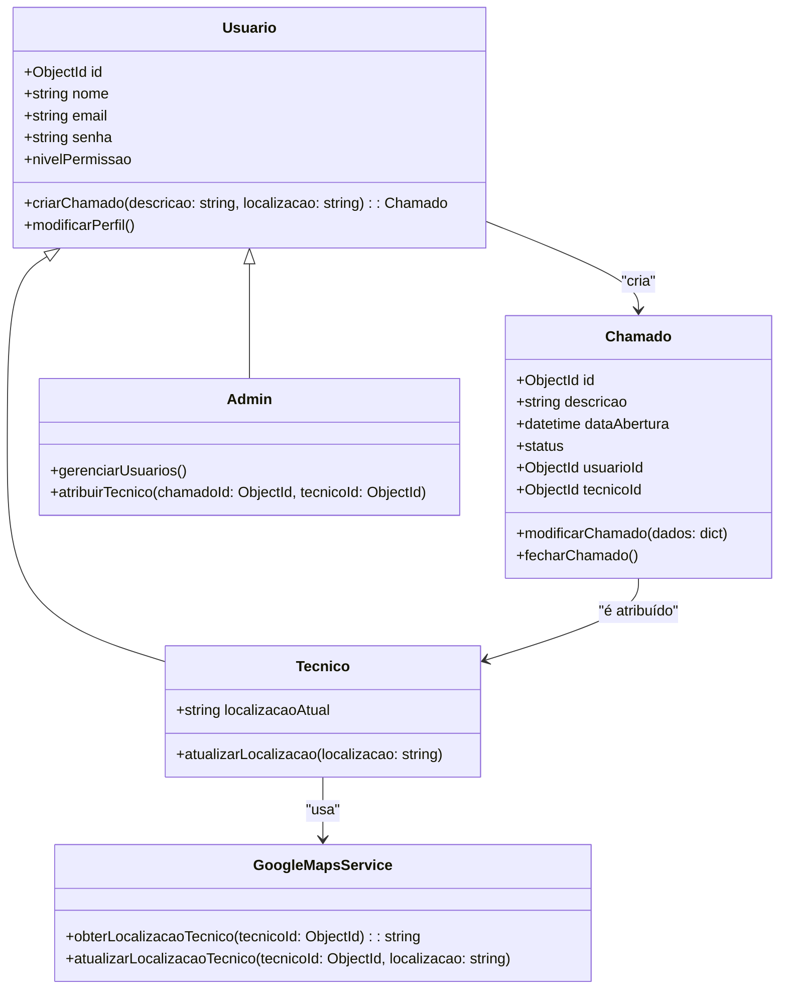

# Helpdesk-backend
### Descrição
A Help Desk Application é uma solução robusta para o gerenciamento de chamados técnicos e suporte ao cliente. Essa aplicação permite que os usuários relatem problemas, acompanhem o status dos chamados e que administradores e técnicos gerenciem os tickets de forma eficiente. Além disso, integra a API do Google Maps para monitoramento da localização em tempo real dos técnicos, otimizando a alocação de recursos.

Esta aplicação foi desenvolvida utilizando Node.js, TypeScript, e MongoDB para garantir escalabilidade, segurança e desempenho.
### Recursos Principais
* Funcionalidades de Usuário
* Registro de usuários com níveis de permissão:
- Usuário: Pode abrir e acompanhar chamados.
- Técnico: Pode gerenciar os chamados atribuídos a ele.
- Administrador: Possui controle total sobre usuários e chamados.
* Autenticação e gerenciamento de sessão.
### Gerenciamento de Chamados
* Criação, atualização e encerramento de chamados.
### Controle de status dos chamados:
- Aberto
- Pendente
- Fechado
### Visualização de histórico dos chamados.
### Monitoramento de Técnicos (ainda sendo desenvolvido)
Integração com a API do Google Maps para rastrear a localização em tempo real dos técnicos no campo.
Banco de Dados
Persistência dos dados usando MongoDB, com estrutura organizada para usuários e chamados.
## Tecnologias Utilizadas
### Backend
* Node.js: Plataforma para execução do JavaScript no servidor.
* TypeScript: Adicionado para tipagem estática e segurança no desenvolvimento.
* Express.js: Framework para construção de APIs RESTful.
* MongoDB: Banco de dados NoSQL, acessado via Mongoose.
* Session Management: Gerenciado com express-session para persistência de dados de autenticação.
* Google Maps API: Utilizada para rastreamento da localização dos técnicos.

